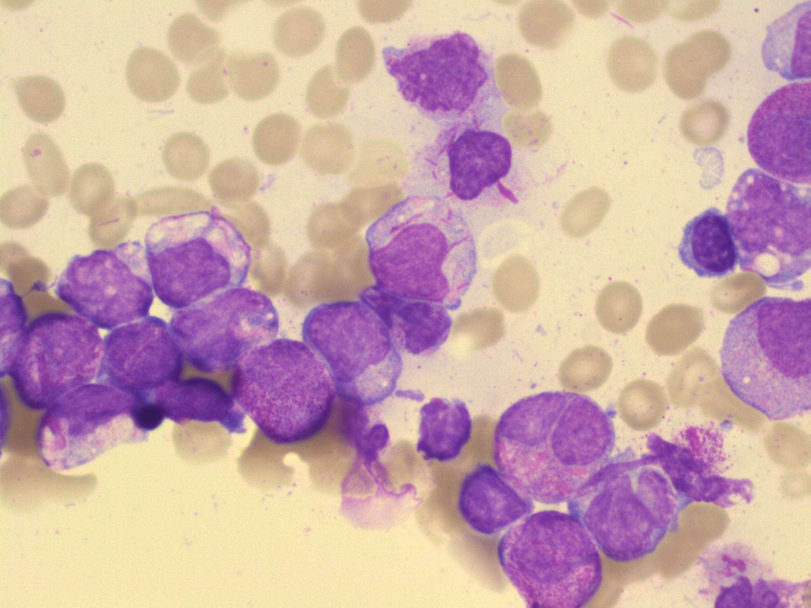

# Blast Cell Images Dataset
## Описание
Этот датасет содержит изображения бластных клеток, размеченные для использования в задачах компьютерного зрения, таких как сегментация и классификация. Датасет состоит из 48 изображений в формате .jpg. Для каждой картинки предоставлены разметки в виде полигонов, которые описывают области интереса (AOI).

## Пример изображения


## Структура данных
- images/: директория, содержащая 48 изображений бластных клеток в формате .jpg.
- ground_truth.json: файл, содержащий разметки полигонов для каждого изображения.

###  Формат файла ground_truth.json
Файл ground_truth.json представляет собой словарь, где ключи — порядковые номера изображений (начиная с 1), а значения — списки полигонов. Каждый полигон описан последовательностью координат.

Пример структуры ground_truth.json:

```
{
    "1": [
        [x1, y1, x2, y2, ..., xn, yn],
        ...
    ],
    "2": [
        [x1, y1, x2, y2, ..., xn, yn],
        ...
    ],
    ...
}
```
- 1, 2, ... — порядковые номера изображений.
- [x1, y1, x2, y2, ..., xn, yn] — координаты вершин полигона на изображении.

## Скачать
```
git clone https://github.com/K-Grachev-2106756/blast_cell_dataset.git
```