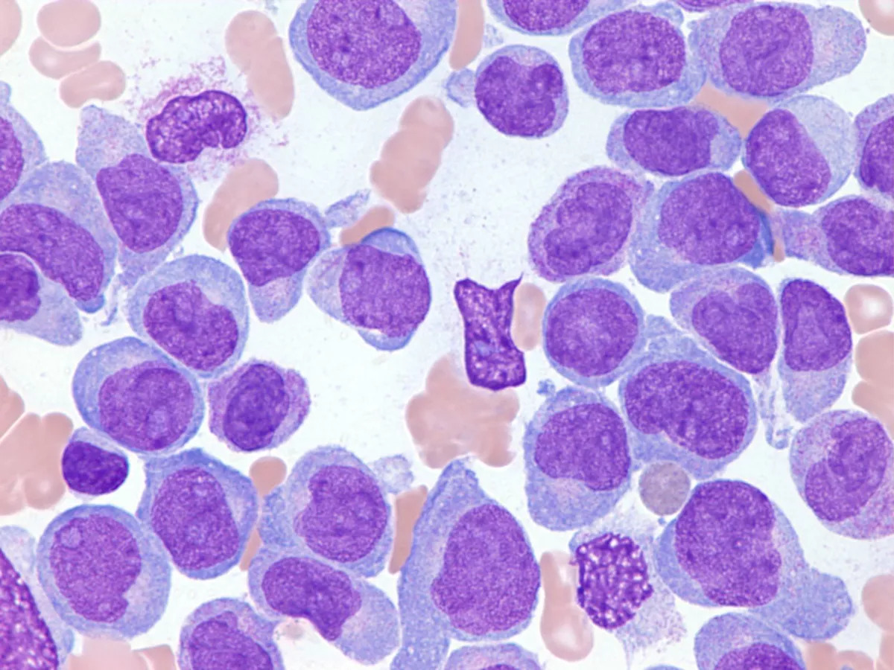
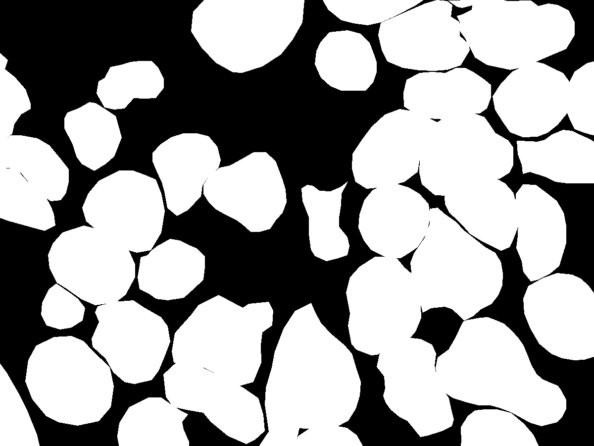

# Blast Cell Images Dataset
## Описание
Этот датасет содержит изображения бластных клеток, размеченные для использования в задачах компьютерного зрения, таких как сегментация и классификация. Датасет состоит из 48 изображений в формате .jpg. Для каждой картинки предоставлены разметки в виде полигонов, которые описывают области интереса (AOI).

## Пример изображения и маски




## Структура данных
- images/: директория, содержащая 48 изображений бластных клеток в формате .jpg.
- masks/: директория, содержащая сгенерированные маски для каждого изображения.
- ground_truth.json: файл, содержащий разметки полигонов для каждого изображения.

###  Формат файла ground_truth.json
Файл ground_truth.json представляет собой словарь, где ключи — порядковые номера изображений (начиная с 1), а значения — списки полигонов. Каждый полигон описан последовательностью координат.

Пример структуры ground_truth.json:

```
{
    "1": [
        [x1, y1, x2, y2, ..., xn, yn],
        ...
    ],
    "2": [
        [x1, y1, x2, y2, ..., xn, yn],
        ...
    ],
    ...
}
```
- 1, 2, ... — порядковые номера изображений.
- [x1, y1, x2, y2, ..., xn, yn] — координаты вершин полигона на изображении.

## Генерация масок
```
import os
import json
import cv2
import numpy as np


# Loading markup
with open ("ground_truth.json", "r") as f:
    data = json.loads(f.read())

# Creating a directory for masks if it does not exist
if not os.path.exists("masks"):
    os.makedirs("masks")

for id in data.keys():
    # loading original image to create result image with its shapes
    image = cv2.imread(os.path.join("images", f"{id}.jpg")) 
    height, width, _ = image.shape
    mask = np.zeros((height, width), dtype=np.uint8)
    
    # drawing all polygons in cycle
    for points in data[id]: 
        polygon = np.array(points, dtype=np.float32).reshape((-1, 2)).astype(np.int32)
        cv2.fillPoly(mask, [polygon], 255)
    
    # saving
    cv2.imwrite(os.path.join("masks", f"{id}.jpg"), mask) 
```

## Скачать
```
git clone https://github.com/K-Grachev-2106756/blast_cell_dataset.git
```